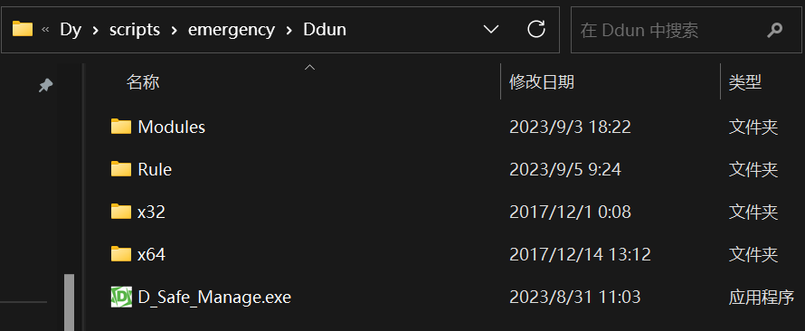
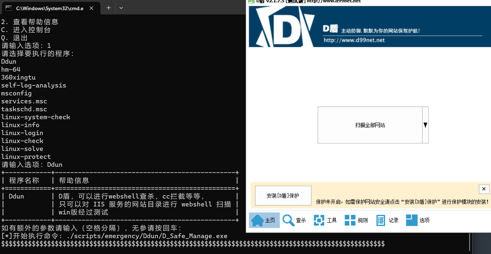
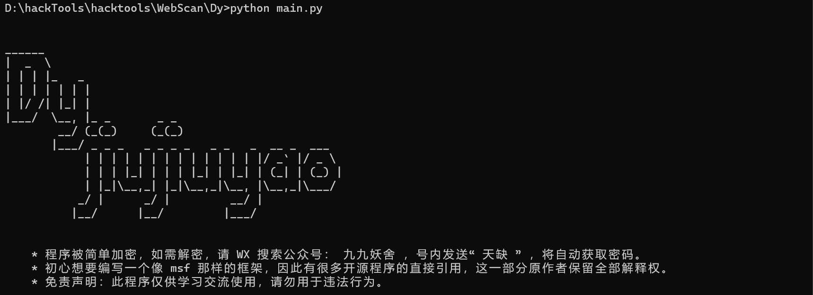
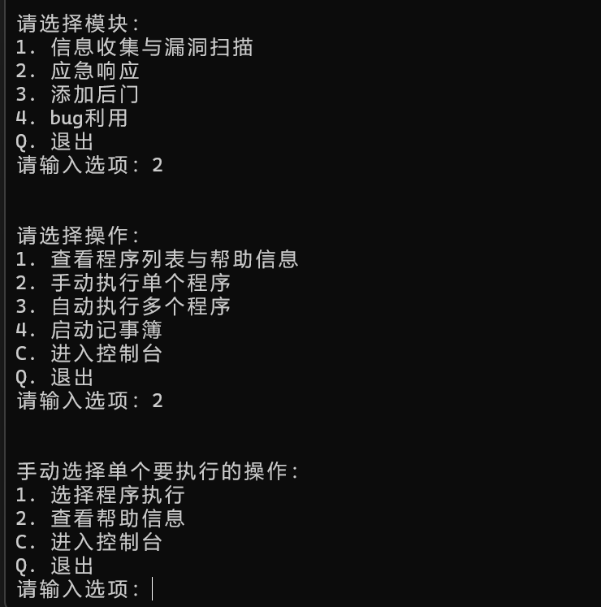
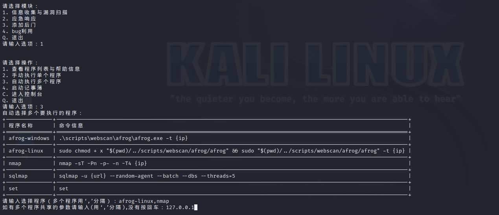

## 天缺（Dy）简介

*当我们考虑网络安全工具的开发初衷时，我们不得不深入思考当今互联网和数字化世界的复杂性。网络空间充满了潜在的威胁和挑战，这些威胁可能来自黑客、恶意软件、数据泄露或其他各种网络攻击。在这个充满威胁的环境中，网络安全工具变得至关重要，它们是保护组织、企业和个人免受网络攻击威胁的第一道防线。
开发我们的网络安全工具框架的初衷是为了应对不断演进的网络威胁，以及日益增长的网络攻击面。在这个复杂的网络安全领域，许多组织和安全专业人员依赖于各种各样的安全工具，这些工具用于扫描漏洞、检测恶意活动、监控网络流量等等。然而，这些工具通常是分散的，各自为战，导致了不必要的复杂性和效率低下。
因此，决定开发一个综合性的网络安全工具框架(天缺-Dy)，旨在简化安全工具的管理和协作。这个框架的目标是为安全专业人员提供一个集成的平台，使他们能够轻松地管理和协调各种安全工具，同时提高对网络安全的整体可见性和响应速度。

## 环境

* 基于python环境开发的框架
* 扩展到程序部分涉及到的环境需要另外安装

## 特点

* 综合性
* 可扩展性
* 易使用性
* 易维护性
* 跨平台性

## 进度

* 目前仅仅开发了一个粗略的框架，扩展程序收集还不完全，功能还待完善

## 安装

1、安装 python 
2、安装依赖（框架本身）,在 ``/Dy`` 目录下的命令窗口执行

~~~
pip install -r requirements.txt
~~~

## 扩展程序添加与配置

当想要将一个完整功能的程序加入`Dy`时，将按如下步骤操作（这里以 D盾 为例）：

* 1、将完整的程序文件放入`Dy\scripts\emergency\Ddun` 文件夹下，如图：

* 2、在相应的配置文件（Dy\config\config_emergency.ini）中配置 D盾 启动命令：
~~~
[Ddun]
command = ./scripts/emergency/Ddun/D_Safe_Manage.exe
common_command = ./scripts/emergency/Ddun/D_Safe_Manage.exe
help_message = D盾，可以进行webshell查杀，cc拦截等等，
				只可以对 IIS 服务的网站目录进行 webshell 扫描
				win版经过测试
~~~

*这里有三个配置参数，`command`用来配置选择手动执行单个程序时要执行的调用命令；`common_command`用来配置选择自动执行多个程序时要执行的调用命令，这里因为D盾执行时候，命令是固定的，因此都配置了相同的命令；`help_message` 是帮助菜单，用于添加程序注释或者介绍的。

* 3、前两步没问题后，就可以在`Dy`中调用执行，如图：

* 注：扩展程序与`Dy`是独立的，与`Dy`结合只需要执行上述步骤即可，如果程序无法执行，请检查扩展程序本身所需要的运行环境，并且确保配置过程中命令路径是正确且有效的。
## 使用

* 执行以下命令将运行`Dy`

~~~
python main.py
~~~

* 主界面是项目的大体区分，现版本有4个模块，在进入想要使用的模块后，将进入另一个选择目录，这里可以选择手动执行单个程序或自动执行多个程序。

* 仍然以D盾为例，这里选择手动执行单个程序

*接下来会提示输入参数，由于启动D盾时候命令是固定的，所以不需要参数，直接回车就好，然后就会执行D盾程序的调用，接下来的操作与正常使用D盾软件没有区别。

* 如果是自动执行多个程序，并且有参数时，这里以同时执行afrog与nmap为例

* 更多功能请自行探索
## 未来计划

* 添加图形化界面
* 增加数据库
* 编写更多功能性脚本
* 添加远控功能

